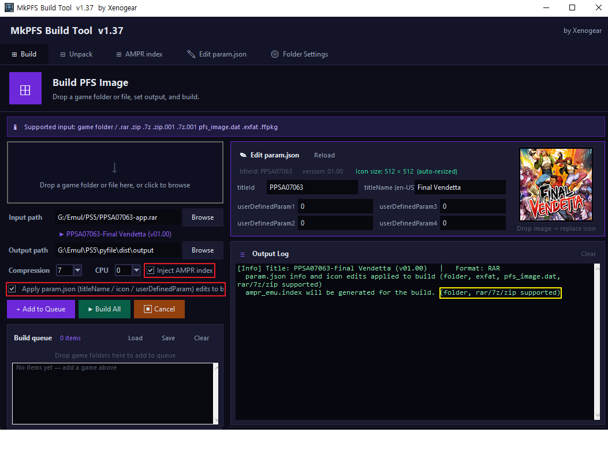

# MkPFS Build Tool `v1.40`

*by Xenogear*



---

A Windows tool that automatically builds PS5 game images.

Just drag a folder or a file (`.exfat` `.ffpkg` `.rar` `.zip` `.7z` `.zip.001` `.7z.001` `pfs_image.dat` `.ffpfsc`) and it is processed automatically.

- Output is about **40–60% smaller** after compression.
- Compressed releases (RAR / ZIP / 7z) can be **built directly without extracting first**.
- During the build you can also edit the title ID, title name, icon, and userDefinedParam of a compressed game.
- **AMPR EMU games** are supported with the auto-generated index included, even while still compressed.

> ※ Everything runs without a separate extraction step, and the tool is optimized to make full use of your CPU and memory.

---

## 🆕 What's new in v1.40 *(since v1.38)*

- **Create exFAT / ffpkg images** — a dedicated tab to build a game as an unpacked `.exfat` / `.ffpkg` image instead of a compressed ffpfsc. **(No separate exFAT builder tool needed anymore!)**
- **exFAT Mount / Edit** — connect an `.exfat` as a new drive and edit its files directly in Explorer.
- **Build format choice** — pick PFS / exFAT / ffpkg when building.
- **ffpfsc info preview** — check a game's name, version, and icon without unpacking.
- **Richer info view** — shows the full userDefinedParam along with an icon preview.
- **Add extra files at build time** — pack your own files/folders into the image during build/create.

---

## How each tab works

Listed in the same order as the tabs at the top of the program. If it's your first time, just follow along in order.

### ⊞ Build — compress a game into ffpfsc

The tab you'll use most. It turns a game into an **ffpfsc file** that you can load onto your PS5.

- Just **drag & drop** a game folder or archive (RAR·ZIP·7z), `pfs_image.dat`, or `.exfat`.
- You can drop RAR/ZIP/7z as-is, without extracting — it's handled automatically.
- Choose the output type among **PFS / exFAT / ffpkg**. (If unsure, just leave it on the default exFAT.)
- Compression level is 1–9, but **level 5 is plenty.** (Higher levels barely reduce size further.)
- You can change the game name, version, and icon right during the build. (Drop an image to replace the icon.)
- **Add extra files/folders** — turn on "Include extra files/folders" and drop the files or folders you want; they are **packed inside the image** during the build. (e.g. newer backport files, fakelib, libSceAmpr.sprx, and other extras.)
- Stack multiple games with **[+ Add to queue]** and **build them all at once**.
- Output filenames are generated cleanly and automatically. Free disk space is also checked before building.

### ◇ Create exFAT/ffpkg `NEW in v1.40`

Use this when you want to make an **image (`.exfat` / `.ffpkg`)** instead of a compressed file (ffpfsc).

- Drop a game folder or archive and an `.exfat` / `.ffpkg` file is created.
- The filename is generated automatically as `TITLEID-Title (version).exfat`.
- RAR/ZIP/7z archives skip the extract-then-rebuild step, so it's **fast and uses almost no temporary space.**
- This feature **requires administrator rights, prompted once on first use.**

### 🖉 exFAT Mount/Edit `NEW in v1.40`

Use this when you want to open the contents of an `.exfat` file and edit them directly in Explorer.

- Drop an `.exfat`, press **[Connect drive]**, and it's created/mounted as a new drive on your PC.
- Add, remove, or edit files in Explorer, then
- be sure to press **[Dismount drive]** so your changes are written back safely. (If you don't, they may be lost!)
- If a drive won't dismount, you can release it from the **[Dismount all virtual drives]** button on the "Folder Settings" tab.

### ⊞ AMPR index

A tab that creates only the **index file (`ampr_emu.index`)** needed by AMPR EMU games. (It's normally included automatically during a build, so use this only when you need to make one separately.)

- Drop a game folder, archive, `.exfat`, or `.ffpkg` to generate the index file.
- For folders/archives it's created at that location; for `.exfat`/`.ffpkg` it's injected directly into the image.
- Progress and remaining time are shown. An existing index is overwritten.

### ✎ Edit param.json — change game name & icon

A tab for changing game info such as **name, version, and icon.**

- Edit the game ID, game name, and version right on screen.
- On a Korean PS5, the Korean name is changed first.
- Drop the image you want for the icon and it's replaced. Even if the size doesn't match, **it's adjusted automatically.**
- Works with any form: folder, archive, `pfs_image.dat`, or `.exfat`.

### ⊟ File Info / Unpack — ffpfsc info & extraction

Use this to **preview which game a file is**, or to **unpack it into a folder (extract).**

- Just drop `.ffpfsc` / `pfs_image.dat` / `.exfat` / `.ffpkg`.
- Shows the game ID, name, and version along with an **icon preview**.
- For ffpfsc, you can check the game info and icon **without unpacking** the whole thing. (It's fast.)
- The **[Rename]** button renames the ffpfsc file to match the game info.

### ⚙ Folder Settings

A tab for setting the locations of folders you use often. Set once and it's remembered.

- Set the output folder, the working folder, and the unpack folder.
- Also set the paths to OSFMount (used by exFAT features) and UFS2Tool (used for ffpkg) here.
- If virtual drives are left mounted and won't release, the **[Dismount all virtual drives]** button releases them all at once.

---

> **※ Note** — Both Korean and English are supported, and you can work comfortably with drag & drop. You're notified when a new version is out, and the files you create can be loaded onto your PS5 with ShadowMountPlus.

---

# mkpfs-worker (bundled GPL CLI)

The build tool ships with **`mkpfs-worker.exe`**, a standalone GPL-3.0 CLI that
wraps the [mkpfs](https://github.com/PSBrew/MkPFS) library. All PFS work is
delegated to this worker as a subprocess, so the GPL boundary stays inside the
worker. This section documents the worker for transparency and GPL compliance.

## Build standalone exe

```
build_worker.bat
```

Produces `dist/mkpfs-worker.exe` (PyInstaller, bundles `mkpfs`).

## Usage

```
mkpfs-worker -V                                  # version + license info
mkpfs-worker pack folder <src_dir> <image> [...]  # passthrough to `mkpfs pack folder`
mkpfs-worker pack file   <src_file> <image> [...] # passthrough to `mkpfs pack file`
mkpfs-worker verify      <image> [...]
mkpfs-worker inspect     <image> --format json|text
mkpfs-worker tree        <image>
mkpfs-worker unpack      <image> <out_dir> [--overwrite]
```

All `mkpfs` pack/verify/inspect/tree/unpack flags are forwarded as-is.

### Worker-only flags (pack/unpack)

- `--yes` — auto-confirm any overwrite prompt mkpfs would otherwise ask for
  interactively (useful when there's no attached console).
- `--stage-mode=copy-fallback` — for `pack file`, fall back to a plain file
  copy when hardlink/symlink staging fails (e.g. exFAT source drives).

### Extra commands

```
mkpfs-worker probe-header <path>
  -> {"type": "pfs"} | {"type": "unknown"}

mkpfs-worker read-member <image> <rel_path> [--as-json]
  -> raw bytes on stdout, or {"json": {...}} / {"data_base64": "..."}

mkpfs-worker read-member-ffpfsc <image> <rel_path> [--as-json] [--with-member-name]
  -> read a member from a .ffpfsc (compressed PFS) via partial decode.
     An unrecognised or malformed inner FS returns NOT_FOUND instead of crashing.
     With --with-member-name the output is always JSON and also carries the
     wrapped-image container name:
       {"member": "pfs_image.dat", "json": {...}}        # JSON member
       {"member": "...",           "data_base64": "..."}  # binary member (icon)
     A miss returns exit 1 + {"error": "NOT_FOUND", "member": "..."} on stderr.

mkpfs-worker probe-ffpfsc-compression <image> [--sample=N]
  -> {"member", "compressed", "logical_size" (uncompressed), "stored_size"
      (compressed), "ratio", "block_size", "block_count", "dominant_flevel",
      "level_bucket"}
     Reports the inner image's PFSC compression: the zlib level is sampled and
     only resolvable to a FLEVEL bucket ("0-1" / "2-5" / "6" / "7-9"), since zlib does
     not preserve the exact 1-9 level. (mkpfs packs at level 7 -> bucket "7-9".)

mkpfs-worker check-space <ffpfsc> <dest> [--margin=<percent>]
  -> {"ok", "need", "need_with_margin", "free", "margin_percent", "shortfall"}
     Checks whether <dest>'s drive has room to unpack the .ffpfsc. need = the
     inner image's logical size; margin defaults to 3%. exit 0 if ok, 1 if not.
     .ffpfsc only — other inputs return exit 2 + {"error": "NOT_FFPFSC"}.

mkpfs-worker member-info <image> <rel_path>
  -> {"exists": bool, "alloc_bytes": int|None, "compressed": bool}

mkpfs-worker patch-member <image> <rel_path> <new_data_file>
  -> {"ok": true} on success, or exit code 1 + {"error": "TOO_LARGE"|"SIGNED"|"COMPRESSED"|"NOT_FOUND"|"NO_BLOCK_POINTER"}
```

`read-member-ffpfsc`, `probe-ffpfsc-compression` and `check-space` are all
read-only.

`patch-member` overwrites a file's payload in place within its existing
allocated blocks — it cannot grow a file past its current allocation, and it
refuses signed or PFSC-compressed images/files.

## Relationship to upstream mkpfs

This project is a **downstream GPL extension of [PSBrew/MkPFS](https://github.com/PSBrew/MkPFS)** —
effectively a fork in spirit, though not a source fork. It does not copy the
`mkpfs` source tree; it depends on the published `mkpfs` package, re-exposes its
`pack` / `verify` / `inspect` / `tree` / `unpack` CLI as passthroughs, and adds
new commands (`probe-header`, `read-member`, `read-member-ffpfsc`,
`probe-ffpfsc-compression`, `check-space`, `member-info`, `patch-member`) that
build on mkpfs internals — notably the `.ffpfsc` partial-decode reader, which
randomly accesses PFSC-compressed images and walks the nested PFS / exFAT / UFS2
filesystem inside them.

Because the standalone exe bundles `mkpfs` and these commands are derived from
its internals, the whole thing is a derivative work and is distributed under the
same GPL-3.0-or-later terms.

## License & public notice

Copyright (C) 2026 xenogear. The bundled `mkpfs-worker` is licensed under
**GPL-3.0-or-later** (see [LICENSE](LICENSE) and [NOTICE](NOTICE)).

This is published as a public statement of GPL compliance:

- **mkpfs-worker is a derivative work** of
  [PSBrew/MkPFS](https://github.com/PSBrew/MkPFS) (GPL-3.0), which it bundles
  and extends. As a derivative work it is distributed under the same
  GPL-3.0-or-later terms.
- The **complete corresponding source** for the worker — including any
  distributed `mkpfs-worker.exe` build — is this repository:
  <https://github.com/glorkim/mkpfs_build_tools>.
- Upstream: MkPFS, © its respective authors, GPL-3.0,
  <https://github.com/PSBrew/MkPFS>.
- The MkPFS Build Tool's own GUI/CLI front-end is a separate program that only
  invokes `mkpfs-worker` as a subprocess (mere aggregation); the GPL covers the
  bundled worker, not the front-end.
- This program is distributed in the hope that it will be useful, but
  **WITHOUT ANY WARRANTY**; without even the implied warranty of
  MERCHANTABILITY or FITNESS FOR A PARTICULAR PURPOSE. See the GNU General
  Public License for more details.
